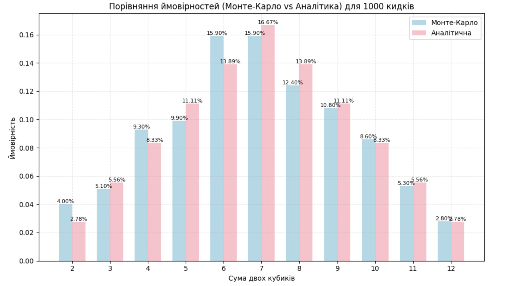
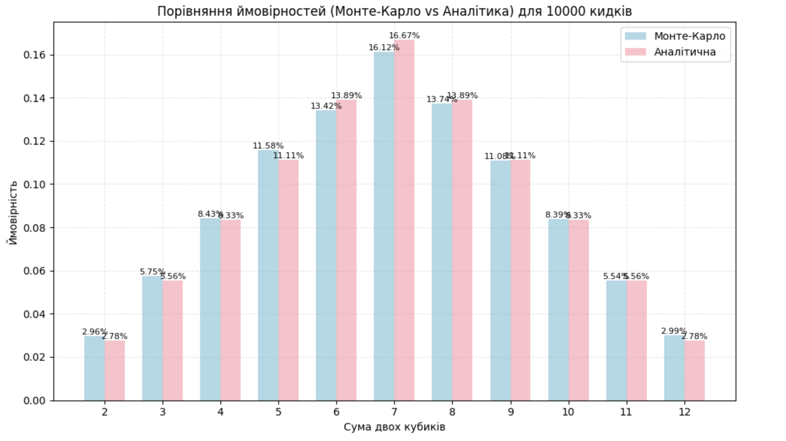
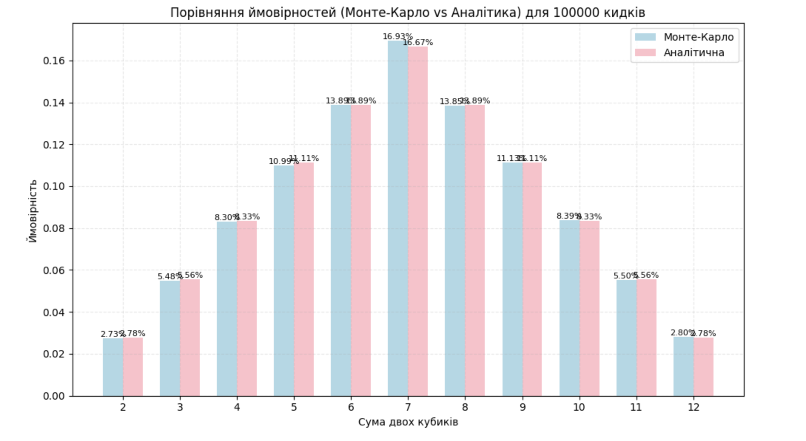

# 🎲 Моделювання кидання двох гральних кубиків (Метод Монте-Карло)

## Теоретичні ймовірності

При киданні пари шестигранних гральних кубиків можливі 36 різних варіантів випадіння значень. Ймовірність отримати певну суму визначається як відношення кількості комбінацій, що призводять до цієї суми, до загальної кількості можливих комбінацій (36).

| Сума | Ймовірність | Комбінацій |
| ---- | ----------- | ---------- |
| 2    | 2.78%       | 1/36       |
| 3    | 5.56%       | 2/36       |
| 4    | 8.33%       | 3/36       |
| 5    | 11.11%      | 4/36       |
| 6    | 13.89%      | 5/36       |
| 7    | 16.67%      | 6/36       |
| 8    | 13.89%      | 5/36       |
| 9    | 11.11%      | 4/36       |
| 10   | 8.33%       | 3/36       |
| 11   | 5.56%       | 2/36       |
| 12   | 2.78%       | 1/36       |

---

## Результати симуляції

### 🎯 Результати моделювання 1000 кидків:

| Сума | Монте-Карло | Аналітична | Різниця |
| ---- | ----------- | ---------- | ------- |
| 2    | 4.00%       | 2.78%      | +1.22 % |
| 3    | 5.10%       | 5.56%      | −0.46 % |
| 4    | 9.30%       | 8.33%      | +0.97 % |
| 5    | 9.90%       | 11.11%     | −1.21 % |
| 6    | 15.90%      | 13.89%     | +2.01 % |
| 7    | 15.90%      | 16.67%     | −0.77 % |
| 8    | 12.40%      | 13.89%     | −1.49 % |
| 9    | 10.80%      | 11.11%     | −0.31 % |
| 10   | 8.60%       | 8.33%      | +0.27 % |
| 11   | 5.30%       | 5.56%      | −0.26 % |
| 12   | 2.80%       | 2.78%      | +0.02 % |

### 🎯 Результати моделювання 10000 кидків:

| Сума | Монте-Карло | Аналітична | Різниця |
| ---- | ----------- | ---------- | ------- |
| 2    | 2.96%       | 2.78%      | +0.18 % |
| 3    | 5.75%       | 5.56%      | +0.19 % |
| 4    | 8.43%       | 8.33%      | +0.10 % |
| 5    | 11.58%      | 11.11%     | +0.47 % |
| 6    | 13.42%      | 13.89%     | −0.47 % |
| 7    | 16.12%      | 16.67%     | −0.55 % |
| 8    | 13.74%      | 13.89%     | −0.15 % |
| 9    | 11.08%      | 11.11%     | −0.03 % |
| 10   | 8.39%       | 8.33%      | +0.06 % |
| 11   | 5.54%       | 5.56%      | −0.02 % |
| 12   | 2.99%       | 2.78%      | +0.21 % |

### 🎯 Результати моделювання з 100000 кидків:

| Сума | Монте-Карло | Аналітична | Різниця |
| ---- | ----------- | ---------- | ------- |
| 2    | 2.73%       | 2.78%      | −0.05 % |
| 3    | 5.48%       | 5.56%      | −0.07 % |
| 4    | 8.30%       | 8.33%      | −0.03 % |
| 5    | 10.99%      | 11.11%     | −0.12 % |
| 6    | 13.89%      | 13.89%     | −0.00 % |
| 7    | 16.93%      | 16.67%     | +0.27 % |
| 8    | 13.85%      | 13.89%     | −0.04 % |
| 9    | 11.13%      | 11.11%     | +0.02 % |
| 10   | 8.39%       | 8.33%      | +0.06 % |
| 11   | 5.50%       | 5.56%      | −0.05 % |
| 12   | 2.80%       | 2.78%      | +0.02 % |

## 

## 📣 Висновок

Метод Монте-Карло забезпечує високу точність результатів за умови великої кількості випробувань (від 10000 і більше). За меншої кількості кидків, наприклад 1000, спостерігаються помітні коливання результатів, що цілком закономірно для малої вибірки. При 100000 спроб емпіричні ймовірності майже повністю збігаються з теоретичними значеннями. Це свідчить про ефективність методу Монте-Карло для оцінювання ймовірностей випадкових подій.
